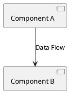
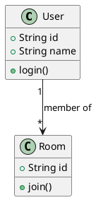
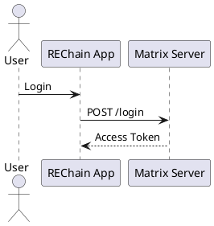

# Diagram Creation Guide

## 📝 Overview

This guide explains how to create, edit, and maintain architecture diagrams for REChain.

**Version:** 4.1.10+1160  
**Last Updated:** 2025-12-06

---

## 🎯 Supported Formats

### 1. Mermaid Diagrams (.mmd)
- **Format:** Markdown-compatible flowchart syntax
- **Tools:** VSCode Mermaid extension, Mermaid Live Editor
- **Location:** `mermaid/` folder
- **Pros:** Git-friendly, easy to edit, renders in GitHub/GitLab

### 2. PlantUML Diagrams (.puml)
- **Format:** Text-based UML syntax
- **Tools:** VSCode PlantUML extension, PlantUML Server
- **Location:** `plantuml/` folder
- **Pros:** Full UML support, powerful modeling features

### 3. SVG Diagrams (.svg)
- **Format:** Scalable Vector Graphics
- **Tools:** Inkscape, Adobe Illustrator, Figma, Diagrams.net
- **Location:** `svg/` folder
- **Pros:** High quality, editable, scalable

---

## 📁 File Naming Conventions

### Pattern
```
<component-name>-<diagram-type>.<extension>
```

### Examples
```
system-architecture.mmd
data-flow.mmd
deployment-topology.svg
class-diagram.puml
sequence-authentication.puml
```

---

## 🎨 Style Guidelines

### Color Palette (REChain Brand)

| Usage | Color | Hex |
|-------|-------|-----|
| Presentation Layer | Blue | `#42A5F5` |
| API Gateway | Green | `#66BB6A` |
| Core Services | Orange | `#FFA726` |
| Data Layer | Red | `#EF5350` |
| Security | Red | `#EF5350` |
| Infrastructure | Purple | `#7E57C2` |
| AI Services | Purple | `#7E57C2` |
| Blockchain | Orange | `#FFA726` |

### Component Shapes

| Component Type | Shape |
|---------------|-------|
| Service/Module | Rectangle |
| Database | Cylinder |
| Storage | Folder |
| External System | Rounded Box |
| User Actor | Circle |
| Mobile App | Phone Icon |

### Line Styles

| Flow Type | Line Style |
|-----------|-----------|
| Data Flow | Solid Arrow |
| Control Flow | Solid Arrow |
| Optional | Dotted Arrow |
| Fallback | Dotted Arrow |
| Bi-directional | Double Arrow |

---

## 🛠️ Tool Setup

### VSCode Extensions

#### Mermaid
```bash
# Extension ID
bk烘烘.drawing-mermaid
```

**Features:**
- Live preview
- Syntax highlighting
- Export to PNG/SVG

#### PlantUML
```bash
# Extension ID
jebbs.plantuml
```

**Features:**
- Live preview
- PlantUML server integration
- Export to multiple formats

### Online Tools

#### Mermaid Live Editor
- URL: https://mermaid.live
- Usage: Quick diagram creation and export

#### PlantUML Server
- URL: http://www.plantuml.com/plantuml
- Usage: Convert .puml to SVG/PNG

---

## 📝 Creating Mermaid Diagrams

### Basic Syntax

```mmd
graph TB
    A[Component A] --> B[Component B]
    B --> C[Component C]
    
    style A fill:#42a5f5
    style B fill:#66bb6a
    style C fill:#ffa726
```

### Subgraphs

```mmd
graph TB
    subgraph "Layer 1"
        A[Component A]
        B[Component B]
    end
    
    subgraph "Layer 2"
        C[Component C]
    end
    
    A --> C
    B --> C
```

### Sequence Diagrams

```mmd
sequenceDiagram
    participant A as Alice
    participant B as Bob
    
    A->>B: Message
    B-->>A: Response
```

### Class Diagrams

```mmd
classDiagram
    class User {
        +String id
        +String name
        +login()
        +logout()
    }
    class Room {
        +String id
        +join()
        +leave()
    }
    User "1" --> "*" Room : member of
```

---

## 📝 Creating PlantUML Diagrams

### Basic Syntax



### Class Diagrams



### Sequence Diagrams



---

## 🔄 Exporting Diagrams

### Mermaid to PNG/SVG

1. Open in Mermaid Live Editor
2. Click "Download PNG" or "Download SVG"
3. Save to `images/` folder

### PlantUML to PNG/SVG

```bash
# Install PlantUML
brew install plantuml  # macOS
sudo apt install plantuml  # Linux

# Generate SVG
plantuml -tsvg diagram.puml

# Generate PNG
plantuml -tpng diagram.puml
```

---

## 📋 Checklist

### Before Adding New Diagram

- [ ] Choose appropriate format (Mermaid/PlantUML/SVG)
- [ ] Follow naming conventions
- [ ] Use REChain color palette
- [ ] Add descriptive filename
- [ ] Include in README.md index
- [ ] Verify renders correctly
- [ ] Test accessibility (alt text)

### Diagram Quality Check

- [ ] Clear title
- [ ] Legend for symbols/colors
- [ ] Consistent styling
- [ ] Readable text size
- [ ] Proper direction (left-to-right or top-to-bottom)
- [ ] No text overlap
- [ ] Appropriate level of detail

---

## 📂 File Structure Example

```
ARCHITECTURE_DIAGRAMS/
├── mermaid/
│   ├── system-architecture.mmd
│   ├── data-flow.mmd
│   └── deployment-topology.mmd
├── plantuml/
│   ├── class-diagram.puml
│   └── sequence-diagram.puml
├── svg/
│   ├── system-overview.svg
│   └── deployment-servers.svg
├── images/
│   ├── system-overview.png
│   └── deployment-servers.png
└── docs/
    ├── diagram-guide.md
    └── version-history.md
```

---

## 🔧 Automation

### Git Pre-commit Hook

Add to `.git/hooks/pre-commit`:

```bash
#!/bin/bash
# Validate Mermaid syntax
for file in ARCHITECTURE_DIAGRAMS/mermaid/*.mmd; do
    if command -v mmdc &> /dev/null; then
        mmdc -i "$file" -o /dev/null || echo "Invalid Mermaid: $file"
    fi
done
```

### CI/CD Validation

```yaml
# .github/workflows/diagrams.yml
name: Validate Diagrams
on: [push, pull_request]

jobs:
  validate-mermaid:
    runs-on: ubuntu-latest
    steps:
      - uses: actions/checkout@v4
      - name: Install Mermaid CLI
        run: npm install -g @mermaid-js/mermaid-cli
      - name: Validate Mermaid diagrams
        run: |
          for f in ARCHITECTURE_DIAGRAMS/mermaid/*.mmd; do
            mmdc -i "$f" -o /dev/null || exit 1
          done
```

---

## 📚 Resources

### Mermaid Documentation
- Official Docs: https://mermaid.js.org
- Examples: https://mermaid.js.org/intro/examples.html

### PlantUML Documentation
- Official Docs: https://plantuml.com
- Cheat Sheet: https://plantuml.com/cheatsheet

### Design Resources
- Color Palette: https://material.io/design/color
- Icons: https://fonts.google.com/icons

---

## 🤝 Contributing

1. Create diagram in appropriate format
2. Follow naming conventions
3. Add to README.md index
4. Test rendering
5. Submit pull request

### Code Review Checklist
- [ ] Syntax is valid
- [ ] Follows style guidelines
- [ ] Uses correct colors
- [ ] Includes legend
- [ ] Descriptive filename

---

## 📞 Support

- **Issues:** GitHub Issues
- **Matrix:** #chatting:matrix.katya.wtf
- **Email:** support@rechain.network

