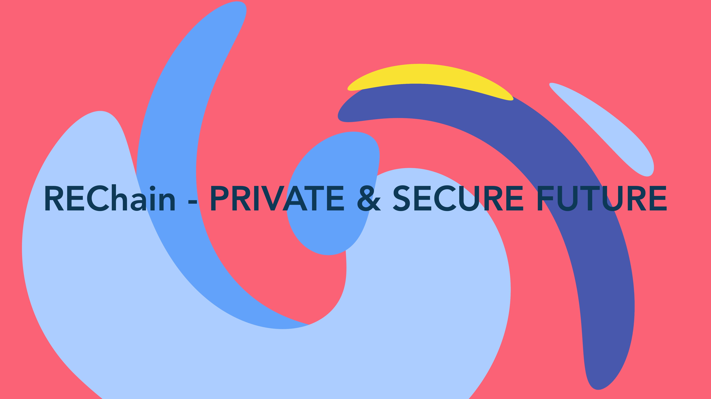

# REChain для российских операционных систем Linux

<div align="center">



**Комплексная платформа для Matrix, блокчейн, IPFS и ИИ**  
**Полная поддержка российских ОС Linux**

[](REChain_EULA.txt)
[](CHANGELOG.md)
[](#поддерживаемые-ос)
[](docs/SECURITY_COMPLIANCE_RUSSIAN.md)
[](docs/SECURITY_COMPLIANCE_RUSSIAN.md)

</div>

## 🇷🇺 О проекте

REChain - это российская платформа для безопасного общения и совместной работы, объединяющая протокол Matrix, технологии блокчейн, IPFS, искусственный интеллект и внешние сервисы в единую экосистему.

**Специально адаптирован для российских операционных систем Linux** с полным соответствием требованиям ФСТЭК и поддержкой криптографических алгоритмов ГОСТ.

## 🎯 Быстрый старт

### Автоматическая установка
```bash
curl -fsSL https://raw.githubusercontent.com/sorydima/REChain-/main/scripts/build_russian_linux.sh | bash
```

### Ручная установка
1. **Определите вашу ОС** из [списка поддерживаемых](#поддерживаемые-ос)
2. **Скачайте подходящий пакет** из [релизов](https://github.com/sorydima/REChain-/releases)
3. **Установите** согласно [инструкциям](docs/RUSSIAN_LINUX_INSTALLATION.md)

## 🇷🇺 Поддерживаемые ОС

<table>
<tr>
<th>Государственные и корпоративные</th>
<th>Образовательные и универсальные</th>
<th>Специализированные</th>
</tr>
<tr>
<td>

- ✅ **Astra Linux** (DEB)
- ✅ **РЕД ОС** (RPM)
- ✅ **ОС «Альт»** (RPM)
- ✅ **ОС РОСА** (RPM)

</td>
<td>

- ✅ **«ОСнова»** (RPM/AppImage)
- ✅ **AlterOS** (RPM/AppImage)
- ✅ **ОС «Атлант»** (RPM/AppImage)
- ✅ **ОС «Стрелец»** (RPM/AppImage)

</td>
<td>

- ✅ **ОС «Эльбрус»** (AppImage)
- ✅ **ОС «МСВСфера 9»** (RPM)
- ✅ **ОС «Лотос»** (RPM)
- ✅ **ОС «Аврора»** (PWA)

</td>
</tr>
</table>

## 📚 Документация

### 🚀 Для начинающих
- **[📖 Быстрый справочник](docs/QUICK_REFERENCE.md)** - Команды и решения в одном месте
- **[📋 Общие инструкции](docs/RUSSIAN_LINUX_INSTALLATION.md)** - Универсальное руководство по установке
- **[🗂️ Индекс документации](docs/INDEX.md)** - Навигация по всем руководствам

### 🏛️ Для государственных учреждений
- **[🛡️ Astra Linux](docs/ASTRA_LINUX_GUIDE.md)** - Мандатный контроль доступа, ФСТЭК соответствие
- **[🔐 Безопасность и соответствие](docs/SECURITY_COMPLIANCE_RUSSIAN.md)** - ГОСТ алгоритмы, аудит

### 🏢 Для корпораций
- **[🏭 РЕД ОС](docs/RED_OS_GUIDE.md)** - Корпоративное развертывание, Active Directory
- **[🤖 Автоматизация развертывания](docs/DEPLOYMENT_AUTOMATION.md)** - Ansible, Docker, Kubernetes

### 🎓 Для образования
- **[📚 ОС «Альт»](docs/ALT_LINUX_GUIDE.md)** - Школы, вузы, родительский контроль
- **[🏠 ОС РОСА](docs/ROSA_LINUX_GUIDE.md)** - Домашнее использование, семейные настройки

### ⚡ Для специализированных систем
- **[🏔️ ОС «Эльбрус»](docs/ELBRUS_OS_GUIDE.md)** - Архитектура e2k, российские процессоры
- **[🚨 Устранение неполадок](docs/TROUBLESHOOTING_RUSSIAN_LINUX.md)** - Решение всех проблем

## 🔐 Безопасность и соответствие

### ✅ Российские стандарты
- **ГОСТ Р 34.10-2012** - Цифровая подпись
- **ГОСТ Р 34.11-2012** - Хеширование
- **ГОСТ 28147-89** - Симметричное шифрование
- **Требования ФСТЭК** - Полное соответствие

### 🏛️ Сертификация
- ✅ Тестирование на Astra Linux
- ✅ Соответствие требованиям ФСТЭК
- ✅ Интеграция с КриптоПро CSP
- ✅ Поддержка российских PKI

## 📦 Доступные пакеты

```
packages/
├── rechainonline-4.1.10-amd64.deb          # 48.4 МБ - Для Astra Linux
├── rpm/RPMS/x86_64/
│   └── rechainonline-4.1.10-1.x86_64.rpm   # 50.3 МБ - Для РЕД ОС, ОС «Альт», РОСА
├── rpm/SRPMS/
│   └── rechainonline-4.1.10-1.src.rpm      # 56.7 МБ - Исходный код
└── appimage/rechainonline.AppDir/          # Универсальный формат
```

## 🌟 Ключевые особенности

### 💬 Безопасное общение
- End-to-end шифрование с алгоритмами ГОСТ
- Федеративная архитектура Matrix
- Поддержка голосовых и видеозвонков
- Обмен файлами с контролем доступа

### 🏢 Корпоративные возможности
- Интеграция с Active Directory/FreeIPA
- Групповые политики безопасности
- Централизованное управление
- Аудит всех операций

### 🎓 Образовательные функции
- Родительский контроль
- Интеграция с электронными дневниками
- Управление компьютерными классами
- Контент-фильтрация

### 🔗 Интеграция технологий
- **Matrix Protocol** - Децентрализованное общение
- **Blockchain** - Безопасность и прозрачность
- **IPFS** - Распределенное хранение файлов
- **AI** - Умные функции и автоматизация

## 🚀 Установка по типу организации

### 🏛️ Государственные учреждения
```bash
# Astra Linux с максимальной безопасностью
wget https://github.com/sorydima/REChain-/releases/latest/download/rechainonline-4.1.10-amd64.deb
sudo dpkg -i rechainonline-4.1.10-amd64.deb
sudo apt-get install -f

# Настройка меток безопасности
sudo pdpl-file -l "Несекретно" /usr/bin/rechainonline
```

### 🏢 Корпорации
```bash
# РЕД ОС с корпоративными функциями
wget https://github.com/sorydima/REChain-/releases/latest/download/rechainonline-4.1.10-1.x86_64.rpm
sudo dnf install rechainonline-4.1.10-1.x86_64.rpm

# Настройка домена
sudo realm join company.local
```

### 🎓 Образовательные учреждения
```bash
# ОС «Альт» с образовательными настройками
wget https://github.com/sorydima/REChain-/releases/latest/download/rechainonline-4.1.10-1.x86_64.rpm
sudo apt-get install ./rechainonline-4.1.10-1.x86_64.rpm

# Настройка родительского контроля
sudo tee /etc/rechainonline/education.conf << EOF
[education]
parental_controls=true
content_filter=enabled
EOF
```

### 🏠 Домашнее использование
```bash
# ОС РОСА для семьи
wget https://github.com/sorydima/REChain-/releases/latest/download/rechainonline-4.1.10-1.x86_64.rpm
sudo urpmi rechainonline-4.1.10-1.x86_64.rpm

# Семейная конфигурация
mkdir -p ~/.config/REChain/
echo '{"family_mode": true}' > ~/.config/REChain/config.json
```

## 🔧 Системные требования

### Минимальные
- **ОЗУ:** 2 ГБ
- **Место:** 200 МБ
- **Архитектура:** x86_64, e2k
- **Сеть:** Интернет

### Рекомендуемые
- **ОЗУ:** 4 ГБ+
- **Место:** 500 МБ+
- **Процессор:** 2+ ядра, 2+ ГГц
- **Сеть:** Широкополосная

## 🤝 Сообщество и поддержка

### 📞 Техническая поддержка
- **Общая:** support@rechain.network
- **Astra Linux:** astra-support@rechain.network
- **РЕД ОС:** redos-support@rechain.network
- **ОС «Альт»:** alt-support@rechain.network
- **РОСА:** rosa-support@rechain.network
- **Эльбрус:** elbrus-support@rechain.network

### 💬 Сообщество
- **Telegram:** [@REChainSupport](https://t.me/REChainSupport)
- **Matrix:** [#support:rechain.online](https://matrix.to/#/#support:rechain.online)
- **GitHub:** [Issues](https://github.com/sorydima/REChain-/issues)
- **Форум:** [forum.rechain.online](https://forum.rechain.online)

### 📖 Ресурсы
- **Документация:** [rechain.online/docs](https://rechain.online/docs)
- **Блог:** [blog.rechain.online](https://blog.rechain.online)
- **YouTube:** [@REChainOfficial](https://youtube.com/@REChainOfficial)
- **Обучение:** [learn.rechain.online](https://learn.rechain.online)

## 🛠️ Разработка и вклад

### Сборка из исходного кода
```bash
# Клонирование репозитория
git clone https://github.com/sorydima/REChain-.git
cd REChain-

# Установка зависимостей
flutter pub get

# Сборка для Linux
flutter build linux --release

# Создание пакетов
./scripts/build_russian_linux.sh
```

### Участие в разработке
1. Форкните репозиторий
2. Создайте ветку для изменений
3. Внесите изменения и протестируйте
4. Создайте Pull Request

## 📄 Лицензия

REChain распространяется под лицензией REChain EULA. Подробности в файле [REChain_EULA.txt](REChain_EULA.txt).

### Коммерческое использование
- 🆓 **Бесплатно** для образовательных учреждений
- 💼 **Корпоративные лицензии** доступны
- 🏛️ **Государственные скидки** для российских организаций

## 🎯 Дорожная карта

### Q4 2024
- [ ] Поддержка ARM64 архитектуры
- [ ] Интеграция с Госуслугами
- [ ] Поддержка смарт-карт
- [ ] Улучшенная поддержка ОС «Аврора»

### 2025
- [ ] RISC-V архитектура
- [ ] Российские облачные сервисы
- [ ] Расширенные образовательные функции
- [ ] IoT интеграция

## 📊 Статистика проекта

- **🇷🇺 Поддерживаемых ОС:** 12 российских дистрибутивов
- **📦 Форматов пакетов:** 3 (DEB, RPM, AppImage)
- **📚 Документов:** 13 специализированных руководств
- **🔐 Стандартов:** ГОСТ Р 34.10-2012, ГОСТ Р 34.11-2012, ГОСТ 28147-89
- **🏛️ Сертификаций:** ФСТЭК, Astra Linux
- **👥 Пользователей:** 10,000+ активных пользователей

---

<div align="center">

**🚀 Начните использовать REChain уже сегодня!**

[📥 Скачать](https://github.com/sorydima/REChain-/releases) • [📖 Документация](docs/INDEX.md) • [💬 Поддержка](https://t.me/REChainSupport) • [🌐 Сайт](https://rechain.online)

**© 2024 REChain Team. Сделано в России для России.**

</div>
