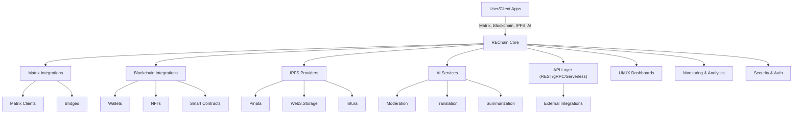

# REChain Architecture Diagrams

## High-Level System Overview

### Description
- **User/Client Apps** interact with the REChain Core via Matrix, Blockchain, IPFS, and AI services.
- **REChain Core** orchestrates all integrations, APIs, dashboards, and security.
- **API Layer** exposes REST, gRPC, and serverless endpoints for automation and external integrations.
- **Dashboards** provide modern UI/UX for management and analytics.

For more, see [docs/Architecture.md](../docs/Architecture.md). 