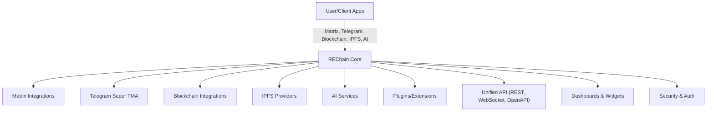

# Architecture

## High-Level Overview

## Component Breakdown
- **Flutter App**: UI, dashboards, user flows
- **Super TMA Bridge**: Telegram/Matrix sync, plugins, admin, API
- **Plugins**: Extensible features (AI, analytics, payments, etc.)
- **API Server**: Unified REST/WebSocket API for all features
- **RBAC & SSO**: Security, roles, permissions, OAuth2
- **Dashboard**: Web widgets, metrics, logs, plugin management
- **CI/CD**: Automated tests, builds, deploys

## Data Flows
- Messages, media, and commands flow between Telegram, Matrix, and other services via the bridge
- Plugins can intercept, modify, or extend flows
- API and dashboard provide observability and control

--- 